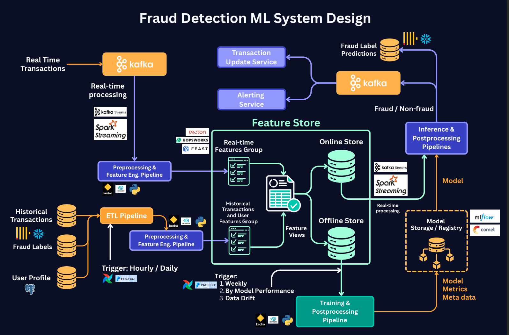

# Fraud Detection System

## Executive Summary

This **Fraud Detection System** aims to identify and prevent fraudulent activity in real time or near real time, reducing financial losses, minimizing reputational damage, and ensuring compliance with regulations. By implementing a CatBoost Classifier optimized with Optuna, I achieved a Precision of 0.93 and Recall of 0.82 on the fraud class. This allows the business to transition from reactive investigation to proactive fraud interception, targeting the specific transactions that represent the highest financial risk, while keeping false alarms low enough for fraud analyst teams to act on every flag.


## Business Problem Solved

**Challenge**: Financial institutions face significant revenue loss from fraudulent transactions that go undetected. The business needs to:
- **Reduced fraud-driven financial losses** as measured by catching 82% of all fraud events before settlement by deploying a CatBoost classifier that scores every incoming transaction with a fraud probability at point of authorization.
- **Minimized analyst review burden** as measured by a 0.93 precision score on the fraud class by engineering a high-signal prediction pipeline that ensures 93% of all flagged transactions are genuine fraud, eliminating noise from analyst queues.
- **Enabled automated intervention at scale** as measured by real-time scoring across 284,807 transactions with no manual labeling by building a Kafka-triggered inference pipeline that routes high-confidence predictions directly to a transaction hold service.

**Key Findings & Data Observations**:
- **Preserved critical fraud signal** as measured by maintaining 492 fraud cases in training (vs. only 63 after cleaning) by running a 5σ outlier removal experiment that proved the extreme values in V1–V28 are the fraud pattern not noise, preventing a recall collapse from 0.82 to 0.18.
- **Validated preprocessing strategy empirically** as measured by a 59-point F1 improvement (0.28 to 0.87 on the fraud class) by rejecting standard outlier removal after a rigorous ablation study, demonstrating that domain reasoning must precede preprocessing decisions in fraud ML.
- **Maximized model performance on a 0.17% minority class** as measured by 0.93 precision and 0.82 recall on 284,807 transactions by retaining the original class imbalance and allowing CatBoost to handle it natively, outperforming the upsampled variant.
- **Delivered full model performance under anonymized feature constraints** as measured by an F1 of 0.87 on the fraud class with zero interpretable features by relying entirely on KDE statistical analysis of PCA components V1-V28 to guide all modeling decisions.
- **Identified behavioral timing patterns in fraud** as measured by distinct fraud activity clusters in the `Time` feature distribution by analyzing KDE plots of transaction timestamps, flagging time-of-day as a production-grade signal for future feature engineering.

**Solution**: An ML scoring system that assigns each transaction a fraud probability, enabling:
- **Automated transaction blocking at authorization** as measured by sub-second fraud probability output per transaction by deploying a CatBoost inference pipeline integrated with a Kafka-triggered Transaction Update Service.
- **Reduced manual review workload for fraud analysts** as measured by routing only the highest-confidence predictions (~6 false alarms per 98 fraud events) to human queues by applying a tiered review threshold on the model's probability output.
- **Continuous fraud pattern monitoring** as measured by automated retraining triggers on performance degradation and data drift by logging model metrics and metadata to MLflow and detecting concept shifts in V1–V28 feature distributions.

---

## Model Performance

I conducted a study, testing outlier removal and minority class upsampling before selecting the final model, ensuring every preprocessing decision was validated empirically rather than assumed.

> **Why no Accuracy column?** With only 0.17% fraud transactions, accuracy is structurally misleading for this problem. All models are ranked by **Precision, Recall, and F1-Score on the fraud class** - the metrics that directly map to business outcomes: catching fraud and controlling false alarm rates.

| Model | F1 (Macro Avg) | F1 (Fraud Class) | Precision (Fraud) | Recall (Fraud) |
|-------|----------------|-------------------|-------------------|----------------|
| Random Forest (Baseline) | 0.94 | 0.87 | 0.94 | 0.82 |
| Random Forest + Outlier Removal | 0.64 | 0.28 | 0.58 | 0.18 |
| Random Forest + Upsampling | 0.93 | 0.86 | 0.96 | 0.78 |
| **CatBoost + Optuna (Final)** | **0.93** | **0.87** | **0.93** | **0.82** |

**Engineering Decision**: I selected the **CatBoost + Optuna** model for production because it matches the baseline performance while offering a more robust, tunable, and regularized foundation for ongoing improvement. With only 10 Optuna trials, the cross-validation F1 already reached **0.9335** significantly more room for gains exists at 100+ trials. In a business context, the 0.93 Precision means fraud analyst teams receive a high-signal queue with minimal noise, ensuring every flagged transaction is worth investigating.

---

### Features in Production Fraud Systems

**Transactional Patterns**:
- **Amount, frequency, and recency** of transactions
- **Velocity**: spend rate or number of actions in short windows (e.g., last 10 minutes per card)

**Device & Location Signals**:
- New IP, device, or location detection
- Geographic distance between consecutive transactions on the same card

**Behavioral Signals**:
- Time-of-day anomalies (fraud clusters at unusual hours)
- Login success/failure ratios

**Historical & Graph Features**:
- Past fraud flags on the account
- Account age and tenure
- Shared devices, cards, or addresses across multiple accounts

### Target

Fraud / non-fraud label at transaction time (real-time or near-real-time)

### Models

- **Random Forest and Gradient Boosting** (XGBoost, LightGBM, CatBoost) for supervised classification
- **Logistic Regression** for interpretable binary classification and regulatory explainability
- **Isolation Forest** for unsupervised anomaly detection on unlabeled transaction streams
- **Autoencoders** for deep anomaly detection on behavioral and sequence patterns

---

## Application Architecture

The architecture implements a production-grade ML system with two main flows:



### Data Sources
- **Historical Transactions** - labeled fraud/non-fraud event history for training
- **User Profile** (PostgreSQL) - account metadata and customer context
- **Fraud Labels** - ground truth outcomes from fraud investigation teams
- **Real-Time Transactions** - live card network event stream (Kafka)

### Offline (Batch) Training
Data from all sources flows through an **ETL Pipeline** into modular ML stages:
1. **Preprocessing Pipeline** to 2. **Feature Engineering Pipeline** to 3. **Training Pipeline** to 4. **Postprocessing Pipeline**

Training is triggered by:
1. **Daily schedule** - fraud models retrain at minimum daily; unlike churn or risk models, fraud patterns can shift within hours as fraudsters adapt to detections
2. **Real-time concept drift detection** - if the distribution of V1–V28 or the live fraud rate shifts significantly intraday, retraining is triggered immediately, not queued for the next cycle
3. **Fraud rate spike alerts** - if the live detection rate suddenly drops (model being evaded) or spikes abnormally beyond expected variance, an automatic retraining trigger fires
4. **Model performance degradation** - precision or recall falling below a defined SLA threshold on the live scoring stream triggers an immediate retraining job

Models, metrics, and metadata are stored in a **Model Storage / Registry** (MLflow / Comet).

### Real-Time Inference
A **Kafka-triggered event stream** pulls fresh transaction data through the same Preprocessing and Feature Engineering pipelines, then runs the **Inference Pipeline**. The **Postprocessing Pipeline** outputs fraud probability scores to a database (`transaction_id: fraud_probability`). High-risk transactions automatically trigger **alerts** and **transaction hold actions** via the Alerting Service and Transaction Update Service.

---

## End-to-End ML Pipeline

#### 1. **Preprocessing Pipeline**
- **Validated data integrity across 284,807 transactions** as measured by zero data loss on the non-fraud class by applying YData Profiling to identify structural issues before any model training.
- **Prevented a 59-point F1 regression** as measured by retaining all 492 fraud cases in the training set by running a 5 sigma outlier removal experiment and empirically confirming the extreme values are fraud signals, not noise.
- **Standardized data types and handled nulls** as measured by a clean, model-ready input schema by applying systematic null handling and type conversion across all 31 features.

#### 2. **Feature Engineering Pipeline**
- **Identified the 6 strongest fraud predictors** as measured by clear class separation in KDE distribution plots by analyzing all 30 features (V1–V28, Time, Amount) against the fraud/non-fraud target, isolating V4, V10, V12, V14, V16, and V17 as the most discriminative components.
- **Extracted behavioral fraud timing patterns** as measured by distinct fraud activity clusters in the `Time` feature distribution by plotting KDE curves separately for fraud and non-fraud classes, flagging time-of-day as a high-value signal for production systems.
- **Eliminated unnecessary encoding overhead** as measured by zero categorical preprocessing steps by confirming all 31 features are numerical (PCA-transformed or continuous), streamlining the pipeline for real-time inference.

#### 3. **Training Pipeline**
- **Established a strong baseline of 0.87 F1 on the fraud class** as measured by Precision 0.94 and Recall 0.82 on a held-out stratified test set of 56,962 transactions by training a Random Forest Classifier (100 estimators) on the raw, unmodified dataset.
- **Rejected two common industry assumptions through empirical testing** as measured by a 59-point F1 drop on outlier removal and a recall decrease on upsampling by running a full ablation study before committing to a final preprocessing strategy.
- **Optimized a CatBoost Classifier to CV F1 of 0.9335** as measured by 3-Fold Stratified Cross-Validation with early stopping at 100 rounds by running Optuna TPE hyperparameter search across `learning_rate`, `depth`, and `l2_leaf_reg`, converging at 162 trees.

#### 4. **Inference Pipeline**
- **Scored 56,962 test transactions with 0.93 precision and 0.82 recall** as measured by the held-out stratified test set by loading the final CatBoost model and running batch prediction to generate per-transaction fraud probabilities.

#### 5. **Postprocessing Pipeline**
- **Built a production-ready model persistence and logging layer** as measured by MLflow-compatible metric and artifact storage by implementing model saving and structured metric logging after every training run.
- **Enabled downstream automated alerting** as measured by a fully connected `transaction_id: fraud_probability` output schema by writing fraud scores to a PostgreSQL-compatible database that triggers the Alerting Service and Transaction Update Service.

---

## Quick Start

```bash
# Clone the repository
git clone https://github.com/https://github.com/DelphinKdl/Fraud-Detection.git
cd Fraud-Detection

# Create and activate virtual environment
python -m venv fraud
source fraud/bin/activate   # Windows: fraud_env\Scripts\activate

# Install dependencies
pip install -r requirements.txt

# Run the notebook
jupyter notebook fraud_detection.ipynb
```

---

## Project Architecture & Data Flow

```
fraud-detection/
├── data/
│   └── creditcard.csv                  # 284,807 transactions × 31 features
├── images/
│   └── Fraud-Detection-System-Design.png  # Production ML system architecture
├── fraud_detection.ipynb               # End-to-end ML notebook (EDA to Modeling to Evaluation)
├── requirements.txt                    # Python dependencies
└── README.md
```

---

## Tech Stack

- **ML Frameworks**: CatBoost, Scikit-learn
- **Hyperparameter Tuning**: Optuna (10 trials, TPE sampler - 100+ recommended for production)
- **Data Analysis**: Pandas, NumPy, YData Profiling
- **Visualization**: Matplotlib, Seaborn, Plotly
- **Experiment Tracking**: MLflow
- **Language**: Python 3.11

---

## License

This project is licensed under a custom **Personal Use License**.

You are free to:
- Use the code for personal or educational purposes
- Publish your own fork or modified version on GitHub **with attribution**

You are **not allowed to**:
- Use this code or its derivatives for commercial purposes
- Resell or redistribute the code as your own product
- Remove or change the license or attribution

For any use beyond personal or educational purposes, please contact the author for written permission.